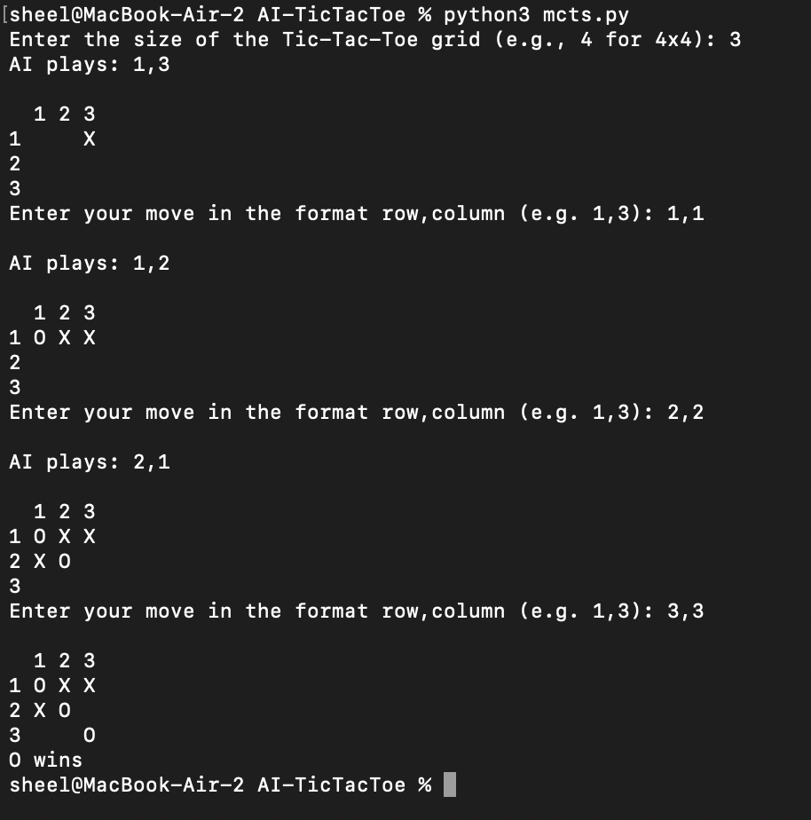

# Tic-Tac-Toe AI

## Overview

This repository contains the code for an Artificial Intelligence Program that can play Tic-Tac-Toe. The AI utilizes the Monte Carlo Tree Search algorithm to find the optimal move against its opponent. 

There are two versions of this script:

The first is the `mcts.py` where a player can play against the AI.

The other version is the `noplayer.py` in which the computer runs simulations on the AI and plots its win rate on a graph. 

## Usage 🚀

```
git clone https://github.com/Sheel2007/AI-TicTacToe
cd AI-TicTacToe
pip3 install -r requirements.txt
python3 mcts.py
```
Note: If the commands pip3 and python3 do not work use the commands pip and python respectively. Additionally, if you want to run the simulation use the command 

```python3 noplayer.py```

or alternatively 

```python noplayer.py```

## Preview 🔎



## Support 

Huge thanks to [Professor David Steier](https://www.heinz.cmu.edu/faculty-research/profiles/steier-david) at Carnegie Mellon Heinz College for giving me the opportunity to work on this project and providing me guidance throughout the development stages. 